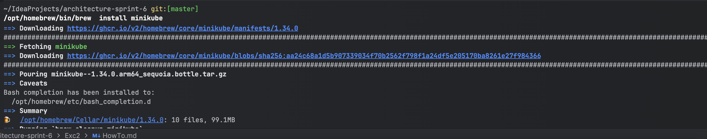
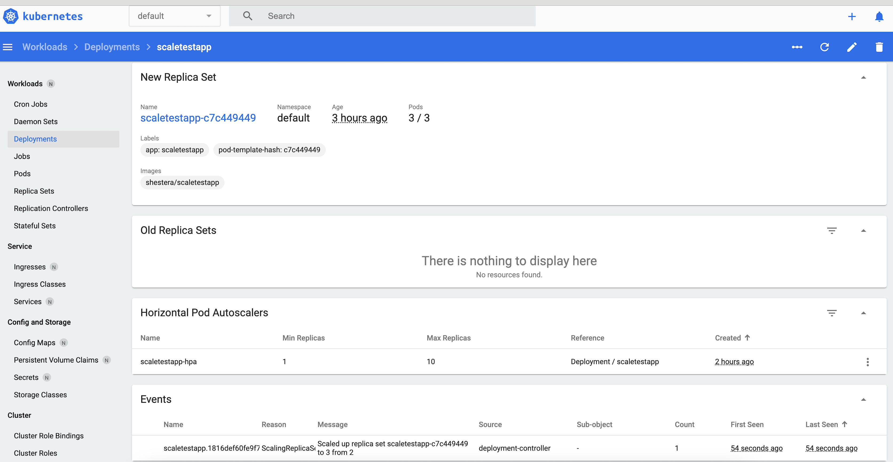

# Здесь будет пояснение как мы установили Kubernetes и настроили auto-scaling

пишу подробно для себя в будущем, никогда сам не настраивал кубер и прочите утилиты

## 1. Сначала устанавливаем Minikube

Minikube — это упрощённый инструмент для запуска полноценного кластера Kubernetes на локальной машине. Он был разработан, чтобы облегчить разработку, тестирование и отладку приложений, работающих на Kubernetes, в локальной среде. Обычно развёртывание кластера Kubernetes требует особых навыков и знаний, присущих DevOps-инженерам. Но для тех, кто только знакомится с Kubernetes или разрабатывает небольшое приложение для развертывания в одном кластере, отлично подходит Minikube.

```bash

/opt/homebrew/bin/brew  install minikube
```



Также помним, что для запуска Minikube необходимы средства виртуализации. На процессорах M3 Pro от Apple не работает много решений, поэтому используем стандартный Docker:

```bash

/opt/homebrew/Cellar/minikube/1.34.0/bin/minikube start --vm-driver=docker
```


## 2. Далее работаем с kubectl

Kubectl — это инструмент командной строки для управления кластерами Kubernetes. kubectl ищет файл config в директории $HOME/.kube. Вы можете указать другие файлы kubeconfig, установив переменную окружения KUBECONFIG или флаг --kubeconfig.


## 3. Разворчиваем докер-образ

```bash

docker pull shestera/scaletestapp
docker scout quickview shestera/scaletestapp
```


#### Описание работы команды `docker pull shestera/scaletestapp`

1. **Подключение к Docker Hub или другому Docker Registry**:
    - Docker соединяется с удалённым реестром контейнеров (по умолчанию это Docker Hub) для поиска указанного образа `shestera/scaletestapp`.

2. **Загрузка образа**:
    - Если образ `shestera/scaletestapp` существует в реестре, Docker загружает его на ваш локальный компьютер.
    - Если образ уже существует локально и совпадает с последней версией из реестра, загрузка не будет выполнена.

3. **Локальное хранилище**:
    - Образ `shestera/scaletestapp` сохраняется в локальном кэше Docker (Docker daemon), чтобы вы могли запускать контейнеры на основе этого образа.

---

#### Что означает `shestera/scaletestapp`?

- **`shestera`**: Это имя пользователя или пространства имен на Docker Hub. Оно указывает на владельца репозитория образа.
- **`scaletestapp`**: Это имя образа, которое описывает приложение. В данном случае, вероятно, это приложение для тестирования масштабирования (scale test app).

#### Описание работы команды `docker scout quickview shestera/scaletestapp`

1. **Анализ образа**:
    - Команда анализирует образ `shestera/scaletestapp`, выявляя зависимости, уязвимости и конфигурации.

2. **Проверка безопасности**:
    - Проводится сканирование на известные уязвимости (например, CVE).

3. **Рекомендации**:
    - Предоставляются советы по улучшению безопасности, обновлению зависимостей и оптимизации образа.

## 4. Запускаем приложение

```bash

kubectl apply -f /Users/DenisErmilov/IdeaProjects/architecture-sprint-6/Exc1/components.yaml
kubectl apply -f /Users/DenisErmilov/IdeaProjects/architecture-sprint-6/Exc1/deployment.yaml
kubectl get pods
kubectl apply -f /Users/DenisErmilov/IdeaProjects/architecture-sprint-6/Exc1/service.yaml
kubectl get svc
```


### Описание команд по созданию приложения `kubectl`

1. **`kubectl apply -f /Users/DenisErmilov/IdeaProjects/architecture-sprint-6/Exc1/components.yaml`**:
   - Применяет конфигурацию из файла `components.yaml` для создания или обновления ресурсов Kubernetes, описанных в этом файле (например, ConfigMap, Secret или другие компоненты).

2. **`kubectl apply -f /Users/DenisErmilov/IdeaProjects/architecture-sprint-6/Exc1/deployment.yaml`**:
   - Применяет конфигурацию из файла `deployment.yaml`, который описывает развертывание приложения в кластере (например, количество реплик, образ контейнера, ресурсы и стратегии обновления).

3. **`kubectl get pods`**:
   - Показывает список всех Pod-ов (единиц вычислений в Kubernetes), запущенных в текущем кластере, включая их статус (Running, Pending, Failed и т.д.).

4. **`kubectl apply -f /Users/DenisErmilov/IdeaProjects/architecture-sprint-6/Exc1/service.yaml`**:
   - Применяет конфигурацию из файла `service.yaml`, которая описывает создание сервиса для управления доступом к Pod-ам (например, через ClusterIP, NodePort или LoadBalancer).

5. **`kubectl get svc`**:
   - Показывает список всех сервисов (Services) в текущем кластере, их тип, IP-адреса и порты, которые они открывают для доступа к Pod-ам.

настраиваем параметры auto-scaling

```bash

kubectl get pods -n kube-system | grep metrics-server
kubectl apply -f /Users/DenisErmilov/IdeaProjects/architecture-sprint-6/Exc1/hpa.yaml
kubectl get hpa

```


### Описание команд `kubectl` - для auto-scaling

1. **`kubectl get pods -n kube-system | grep metrics-server`**:
   - Показывает список Pod-ов в пространстве имен (namespace) `kube-system`, затем фильтрует вывод с помощью `grep` для отображения только тех Pod-ов, которые содержат `metrics-server` в имени. Используется для проверки статуса Pod-а, отвечающего за сбор метрик (необходим для Horizontal Pod Autoscaler).

2. **`kubectl apply -f /Users/DenisErmilov/IdeaProjects/architecture-sprint-6/Exc1/hpa.yaml`**:
   - Применяет конфигурацию из файла `hpa.yaml`, которая описывает настройку горизонтального автоскейлинга (HPA) для автоматического изменения количества реплик Pod-ов на основе метрик (например, нагрузки на процессор или память).

3. **`kubectl get hpa`**:
   - Показывает список всех Horizontal Pod Autoscalers (HPA) в текущем кластере, их статус, минимальное и максимальное количество реплик, текущие метрики (например, CPU) и количество реплик в данный момент.

## 5. Проверка auto scaling

запустили для создания нагрузки спец утилиту - Locus

1. Наше приложение запущено


2. Подали нагрузку

ниже 


смотрим логи minicube как происходило переключение и auto-scaling




и по команде kubectl get hpa


P.S. я не смог загрузить сервер более чем на 80%, ставил разные значегния - до 60 и ниже


--

### PlantUML sequence diagram - examples
```plantuml
Alice -> Bob: Hello Bob, how are you?
Bob --> Alice: I am good thanks!
```
